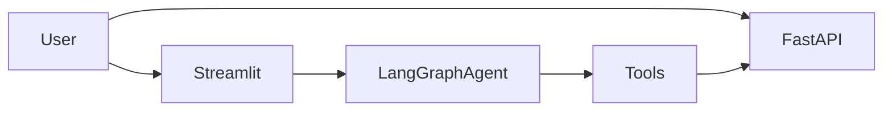

# Tree Evaluator

[](https://github.com/francemazzi/tree-evaluator/actions/workflows/tests.yml)
[](https://www.python.org/downloads/)
[](./LICENSE)

> **Documentazione in italiano:** [QUICKSTART.md](QUICKSTART.md) (chatbot in 5 minuti).

FastAPI service and Streamlit assistant to estimate **CO₂**, **carbon**, and **biomass** for trees from dendrometric inputs, plus an optional **LangGraph** agent over urban tree datasets (Vienna / Milano).

**What you get**

- **REST API** — AGB, BGB, total biomass, carbon stock, CO₂ stock, optional annual CO₂ flux (Chave et al., 2014 pipeline).
- **Streamlit UI** — Chat agent with 20+ tools (NL→SQL, charts, maps, papers, export); SQLite persistence; OpenAI, Anthropic, or Ollama.
- **Datasets** — Cadastre-scale CSV/SQL under `dataset/` (see [Dataset](#dataset)).



## Table of contents

- [Prerequisites](#prerequisites)
- [Quick start](#quick-start)
- [URLs after startup](#urls-after-startup)
- [Demo](#demo)
- [API](#api)
- [Calculation model](#calculation-model)
- [Field glossary](#field-glossary)
- [Streamlit agent](#streamlit-agent)
- [Docker](#docker)
- [Testing](#testing)
- [Dataset](#dataset)
- [Repository layout](#repository-layout)
- [Contributing](#contributing)
- [License](#license)

## Prerequisites

- **Python 3.11** (recommended for local dev and CI parity).
- **Docker** (optional) — Compose files for API + Streamlit; see [DOCKER.md](DOCKER.md).
- **LLM access** (for the chat UI) — `OPENAI_API_KEY` in `.env` (from [`.env.example`](.env.example)), OAuth in the UI, Anthropic, or **Ollama** without a cloud key. Details: [DOCKER.md](DOCKER.md).

## Quick start

Pick one path; all assume the repo root as the working directory.

### A — Install script (macOS / Linux / Windows)

```bash
# macOS / Linux
bash install.sh --run
```

```bat
REM Windows
install.bat --run
```

Then open [http://localhost:8000/docs](http://localhost:8000/docs).

### B — Docker (API + Streamlit)

```bash
# Dev (hot reload): API + Streamlit
docker compose up --build

# Streamlit only
docker compose up streamlit --build

# Production-style
docker compose -f docker-compose.prod.yml up -d
```

Copy `cp .env.example .env` and set `OPENAI_API_KEY` (or use Streamlit settings / Ollama — see [Docker](#docker)). Advanced OAuth, Ollama-in-Docker, and troubleshooting: [DOCKER.md](DOCKER.md).

### C — Manual Python (venv)

```bash
python3.11 -m venv .venv
source .venv/bin/activate   # Windows: .\.venv\Scripts\Activate.ps1
pip install -r requirements.txt
```

**API only**

```bash
uvicorn app.main:app --reload
```

**Streamlit chat** (requires LLM config as above)

```bash
cp .env.example .env
# edit .env — at minimum OPENAI_API_KEY=sk-... unless using Ollama
streamlit run streamlit_app/app.py
```

Use a project-local `.venv` (avoid mixing with system/Anaconda envs when running tests).

## URLs after startup

| Service        | URL |
|----------------|-----|
| API root       | [http://localhost:8000](http://localhost:8000) |
| OpenAPI / docs | [http://localhost:8000/docs](http://localhost:8000/docs) |
| Streamlit chat | [http://localhost:8501](http://localhost:8501) |

## Demo

Screen recording of the Tree AI assistant (Streamlit chat and tools):

<video src="https://github.com/francemazzi/tree-evaluator/raw/main/public/video/tree_ai.mp4" controls playsinline muted width="100%"></video>

If the player does not load, open the file on GitHub: [`public/video/tree_ai.mp4`](public/video/tree_ai.mp4).

## API

- `GET /api/v1/health/` — health check  
- `POST /api/v1/co2/calc` — CO₂ / biomass / carbon for one tree  
- `POST /api/v1/environment/estimates` — volume / biomass / carbon-style environmental estimates (see OpenAPI at `/docs`)  

**Request (JSON)**

```json
{
  "dbh_cm": 30.0,
  "height_m": 15.0,
  "wood_density_g_cm3": 0.6,
  "carbon_fraction": 0.47,
  "root_shoot_ratio": 0.24,
  "annual_biomass_increment_t": 0.03
}
```

**Response (JSON)**

```json
{
  "agb_t": 0.44,
  "bgb_t": 0.106,
  "total_biomass_t": 0.546,
  "carbon_t": 0.256,
  "co2_stock_t": 0.94,
  "co2_annual_t": 0.052
}
```

**cURL**

```bash
curl -X POST "http://localhost:8000/api/v1/co2/calc" \
  -H "Content-Type: application/json" \
  -d '{
    "dbh_cm": 30.0,
    "height_m": 15.0,
    "wood_density_g_cm3": 0.6,
    "carbon_fraction": 0.47,
    "root_shoot_ratio": 0.24,
    "annual_biomass_increment_t": 0.03
  }'
```

Server-side logic for this path lives in `CO2CalculationService` (`app/services/`).

## Calculation model

- **AGB** — Chave et al. (2014): AGB = a × (WD × DBH² × H)^b with a = 0.0673, b = 0.976  
- **BGB** — BGB = RSR × AGB (default RSR 0.24)  
- **Carbon** — C = total dry biomass × CF (default CF 0.47)  
- **CO₂ stock** — CO₂ = C × 44/12 ≈ C × 3.667  
- **Annual CO₂ flux** — Δbiomass × CF × 3.667 when `annual_biomass_increment_t` is set  

Peer-reviewed references used across API and tools: [Chave et al. (2014)](https://doi.org/10.1111/gcb.12629), [Martin et al. (2018)](https://doi.org/10.1007/s10021-017-0198-4), [Cairns et al. (1997)](https://doi.org/10.1007/s004420050128), Paoletti et al. (annual sequestration rates).

## Field glossary

**Inputs (single tree)**

| Field | Meaning |
|-------|--------|
| `dbh_cm` | Diameter at breast height (cm); > 0 |
| `height_m` | Total height (m); > 0 |
| `wood_density_g_cm3` | Wood density (g/cm³); species-specific, often ~0.3–1.0 |
| `carbon_fraction` | Carbon fraction of dry mass (default 0.47); (0, 1) |
| `root_shoot_ratio` | Root:shoot for BGB (default 0.24); > 0 |
| `annual_biomass_increment_t` | Optional dry biomass increment (t tree⁻¹ yr⁻¹); ≥ 0 |

**Outputs**

| Field | Meaning |
|-------|--------|
| `agb_t`, `bgb_t` | Above- / below-ground biomass (t tree⁻¹) |
| `total_biomass_t` | AGB + BGB (t tree⁻¹) |
| `carbon_t` | Carbon stock (t C tree⁻¹) |
| `co2_stock_t` | CO₂-equivalent stock (t CO₂e tree⁻¹) |
| `co2_annual_t` | Annual uptake (t CO₂e tree⁻¹ yr⁻¹); only if increment provided |

Per hectare, multiply by stems ha⁻¹. If species is unknown, use a representative wood density for the biome.

## Streamlit agent

Interactive **Streamlit** UI with **LangGraph** orchestration, tool calling into the same scientific stack (CO₂ aggregate, biomass/volume/allometry, environment estimates), **natural language → SQL** on Vienna/Milano-scale data, **Plotly** charts and **Folium** maps, arXiv/PubMed search, and CSV/Excel export. Default assistant language for synthesized answers is Italian; the API is language-agnostic.

**Learn more (instead of duplicating long tables here)**

- End-user flow and Italian examples: [QUICKSTART.md](QUICKSTART.md)  
- Agent package layout and internals: [streamlit_app/agent/README.md](streamlit_app/agent/README.md)  
- Chart tool behavior: [CHART_TOOL_GUIDE.md](CHART_TOOL_GUIDE.md)  

**Common `.env` knobs** (see `.env.example` for the full list)

```bash
OPENAI_API_KEY=sk-...
# optional
CHAT_DB_PATH=data/chat_index.db
APP_ENV=development
```

## Docker

1. `cp .env.example .env` and set keys / `LLM_PROVIDER=ollama` as needed.  
2. `docker compose up --build` for API + Streamlit.  
3. You can also pass `OPENAI_API_KEY` on the command line or paste a key in Streamlit **Settings** (works even when `.env` is missing).  

The UI supports ChatGPT OAuth, Anthropic (API key or OAuth with local callback on ports `53682–53690`; copy/paste OAuth fallback is available if the browser cannot reach the callback from Docker). For **Ollama** on the host, set `LLM_PROVIDER=ollama` and pull models (`qwen2.5:7b-instruct`, `nomic-embed-text`, etc.); optional Compose profile `with-ollama` and `OLLAMA_BASE_URL=http://ollama:11434` are documented in [DOCKER.md](DOCKER.md).

## Testing

Install dev dependencies for DeepEval contract tests:

```bash
pip install -r requirements-dev.txt
```

**Default test suite (deterministic; no LLM judge)**

```bash
PYTEST_DISABLE_PLUGIN_AUTOLOAD=1 python -m pytest -q
PYTEST_DISABLE_PLUGIN_AUTOLOAD=1 python -m pytest -q tests/test_deepeval_tool_contracts.py
```

**Integration tests (broader)**

```bash
pytest tests/
```

DeepEval tool contracts are deterministic. The optional real agent E2E smoke test runs only when **both** `RUN_DEEPEVAL_AGENT_E2E=1` and `OPENAI_API_KEY` are set.

**CI** — [`.github/workflows/tests.yml`](.github/workflows/tests.yml) runs the deterministic suite on push/PR to `main`/`master`. Manual workflow dispatch can enable real LLM agent E2E; scheduled runs skip E2E if the `OPENAI_API_KEY` secret is absent.

**Ground truth (agent vs `dataset/ground_truth.csv`)**

`python tests/ground_truth_runner.py` loads the CSV, sends each question to `TreeEvaluatorAgent` via `TreeAgentClient`, compares numeric answers (tolerance) and text similarity, and prints a short report. Requires `OPENAI_API_KEY`.

```bash
export OPENAI_API_KEY=sk-...
python tests/ground_truth_runner.py
python tests/ground_truth_runner.py --limit 5
python tests/ground_truth_runner.py --tolerance 0.05 --text-threshold 0.70
```

Pytest wrapper (slow / needs key):

```bash
pytest tests/test_ground_truth_agent.py -v
```

(`@pytest.mark.slow`; skipped without `OPENAI_API_KEY`.)

## Dataset

Place tree cadastre CSV/Excel under `dataset/` for ingestion and chat queries.

- **Vienna** — `BAUMKATOGD.csv` (~230k trees): districts, species, plant year, trunk circumference, height category, street; **no GPS** (maps are not available on this preset).  
- **Milano** — ~60k trees with **GPS coordinates** (maps, heatmaps, clusters); see `dataset/init_milano_db.py` and agent dataset presets.

The agent switches preset via configuration (`DATASET_PRESETS` / UI); see [QUICKSTART.md](QUICKSTART.md) and `streamlit_app/services/data_manager.py` for behavior.

## Repository layout

```text
app/              FastAPI app, routers, services, Pydantic models
streamlit_app/    Streamlit UI, LangGraph agent, tools, LLM adapters
tests/            Pytest, DeepEval contracts, ground truth runners
dataset/          CSV/SQL, ground_truth.csv, init scripts
public/           Static assets (e.g. demo video)
```

## Contributing

Issues and pull requests are welcome. Please run the [Testing](#testing) commands before opening a PR (at minimum `PYTEST_DISABLE_PLUGIN_AUTOLOAD=1 python -m pytest -q` with `requirements-dev.txt` installed). Keep changes focused and match existing style in touched files.

## License

This project is licensed under the MIT License — see [LICENSE](./LICENSE).

Copyright (c) 2026 Frasma Studio
