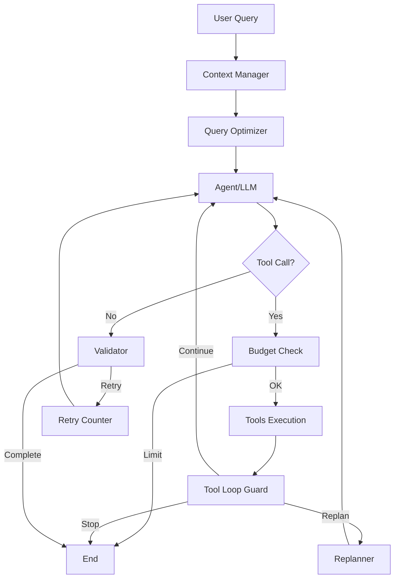

# Agent Module - Architettura

Questo modulo contiene l'implementazione dell'agente di valutazione alberi, organizzato in componenti modulari per massimizzare manutenibilità e testabilità.

## 📁 Struttura del Package

```
streamlit_app/agent/
├── __init__.py              # Esportazioni pubbliche del package
├── core.py                  # Classe principale TreeEvaluatorAgent (~735 righe)
├── budget.py                # Gestione limiti esecuzione (~220 righe)
├── state.py                 # Definizioni stato e configurazioni (~86 righe)
├── formatting.py            # Utility formattazione numeri (~68 righe)
├── extraction.py            # Estrazione dati da messaggi (~326 righe)
├── context_manager.py       # Gestione contesto conversazione (~173 righe)
├── tool_guard.py            # Rilevamento loop nei tool calls (~228 righe)
├── response_builder.py      # Costruzione risposte formattate (~227 righe)
├── prompts.py              # Prompt di sistema centralizzati (~196 righe)
└── streaming_handler.py    # Gestione eventi streaming (~304 righe)
```

## 🎯 Componenti Principali

### 1. `core.py` - TreeEvaluatorAgent
Classe principale che orchestra tutti i tool per l'analisi degli alberi.

**Responsabilità:**
- Inizializzazione LLM e tool
- Costruzione grafo LangGraph
- Gestione workflow conversazionale
- Interfacce pubbliche: `chat()` e `stream_chat()`

**Import:**
```python
from streamlit_app.agent import TreeEvaluatorAgent

agent = TreeEvaluatorAgent(dataset_preset="vienna")
response = agent.chat("Quanti alberi ci sono a Vienna?")
```

### 2. `budget.py` - Budget Management
Prevenzione loop infiniti e controllo risorse.

**Classi:**
- `AgentBudget`: Traccia e limita tool calls, chiamate LLM, tempo esecuzione
- `BudgetAwareToolGuard`: Circuit breaker per enforcement limiti

**Limiti Default:**
- Max tool calls totali: 15
- Max calls per tool: 3
- Max chiamate LLM: 10
- Timeout: 120 secondi
- Max replans: 2

### 3. `state.py` - State & Configuration
Definizioni TypedDict per lo stato dell'agente e configurazioni dataset.

**Contenuto:**
- `AgentState`: TypedDict per stato LangGraph
- `DATASET_PRESETS`: Configurazioni Vienna/Milano

### 4. `formatting.py` - Number Formatting
Formattazione numeri secondo convenzioni italiane.

**Classe:**
- `ItalianNumberFormatter`: Formatta numeri con punto migliaia e virgola decimali

**Esempio:**
```python
formatter = ItalianNumberFormatter()
formatter.format_number(1234.56)  # "1.234,56"
```

### 5. `extraction.py` - Data Extraction
Estrazione dati strutturati da messaggi conversazionali.

**Classe:**
- `DataExtractor`: Estrae dataset results, papers scientifici, fatti chiave, tool results

**Metodi principali:**
- `extract_dataset_results()`: Estrae risultati query dataset
- `extract_papers()`: Estrae paper da ricerche scientifiche
- `extract_key_facts()`: Estrae fatti chiave per contesto
- `extract_tool_results()`: Estrae tutti i risultati tool

### 6. `context_manager.py` - Context Management
Gestione contesto conversazione per evitare limiti token.

**Classe:**
- `ConversationContextManager`: Tronca messaggi lunghi, preserva fatti chiave

**Configurazione:**
- Max messaggi: 10
- Max lunghezza messaggio: 50.000 caratteri
- Vector search per recupero contesto rilevante

### 7. `tool_guard.py` - Loop Detection
Rilevamento e recovery da loop nei tool calls.

**Classe:**
- `ToolLoopManager`: Rileva pattern ripetitivi e forza uscita o replan

**Soglie:**
- Max chiamate stesso tool: 5
- Forza stop dopo: 10 chiamate
- Max replans: 3

### 8. `response_builder.py` - Response Building
Costruzione risposte formattate user-friendly.

**Classe:**
- `ResponseBuilder`: Formatta risultati dataset, fallback responses

**Metodi:**
- `format_dataset_results()`: Formatta risultati query
- `build_dynamic_fallback_response()`: Crea fallback intelligenti

### 9. `prompts.py` - System Prompts
Prompt di sistema centralizzati.

**Classe:**
- `SystemPrompts`: Contiene `MAIN_SYSTEM_PROMPT` con istruzioni complete

### 10. `streaming_handler.py` - Streaming Events
Gestione eventi streaming LangGraph.

**Classe:**
- `StreamingHandler`: Formatta eventi nodi per UI streaming

**Gestisce:**
- Context manager events
- Query optimizer events
- Agent events (tool calls)
- Tools events (risultati)
- Budget check events
- Loop guard events
- Validator events

## 🔄 Workflow dell'Agente



## 🚀 Utilizzo

### Import Base
```python
from streamlit_app.agent import TreeEvaluatorAgent
```

### Inizializzazione
```python
# Dataset preset
agent = TreeEvaluatorAgent(dataset_preset="vienna")

# Dataset custom
agent = TreeEvaluatorAgent(
    custom_db_path=Path("my_data.db"),
    custom_table_name="trees",
    data_description="Alberi di Roma"
)
```

### Chat Sincrona
```python
response = agent.chat(
    message="Quanti alberi ci sono nel distretto 1?",
    history=[
        {"role": "user", "content": "Ciao"},
        {"role": "assistant", "content": "Ciao! Come posso aiutarti?"}
    ]
)
```

### Chat Streaming
```python
for event in agent.stream_chat(message="Calcola CO2 per pino di 30cm DBH"):
    if event["type"] == "reasoning":
        print(f"🔧 {event['content']}")
    elif event["type"] == "response":
        print(f"💬 {event['content']}")
```

## 🧪 Testing

Ogni modulo può essere testato indipendentemente:

```python
# Test budget
from streamlit_app.agent.budget import AgentBudget
budget = AgentBudget(max_total_tool_calls=5)
can_call, reason = budget.can_call_tool("my_tool")

# Test formatter
from streamlit_app.agent.formatting import ItalianNumberFormatter
formatter = ItalianNumberFormatter()
formatted = formatter.format_number(1234.56)

# Test extractor
from streamlit_app.agent.extraction import DataExtractor
extractor = DataExtractor()
results = extractor.extract_dataset_results(messages)
```

## 📊 Metriche

- **File originale**: 2.460 righe
- **File refactored**: 735 righe (-70%)
- **Numero moduli**: 10
- **Dimensione media modulo**: ~185 righe
- **Max dimensione modulo**: 326 righe

## 🎯 Principi di Design

1. **Single Responsibility**: Ogni modulo ha una responsabilità chiara
2. **Dependency Injection**: LLM e embeddings iniettati nel costruttore
3. **Composizione**: Agent compone utility classes invece di ereditarietà
4. **Testabilità**: Componenti isolati facilmente testabili
5. **Type Safety**: TypedDict e type hints completi
6. **OOP**: Classi con metodi chiari e stato encapsulato

## 🔧 Manutenzione

### Aggiungere un nuovo Tool
1. Creare tool in `streamlit_app/tools/my_tool.py`
2. Importare in `core.py`: `from streamlit_app.tools.my_tool import MyTool`
3. Aggiungere alla lista in `_initialize_tools()`: `self._tools.append(MyTool())`

### Modificare Prompt Sistema
1. Editare `prompts.py`
2. Modificare `SystemPrompts.MAIN_SYSTEM_PROMPT`

### Aggiungere Utility
1. Creare nuovo modulo in `agent/my_utility.py`
2. Esportare in `__init__.py`
3. Usare in `core.py`

## 📝 Note

- Il vecchio `agent.py` (2.460 righe) è stato salvato come backup in `agent_old.py.bak`
- La nuova struttura è retrocompatibile: `from streamlit_app.agent import TreeEvaluatorAgent` funziona
- Tutti i test esistenti continuano a funzionare senza modifiche

